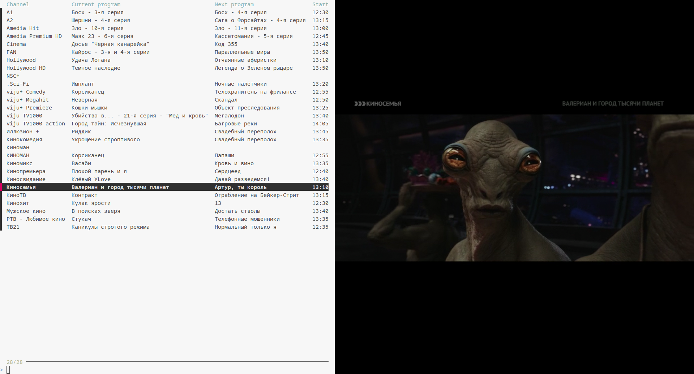
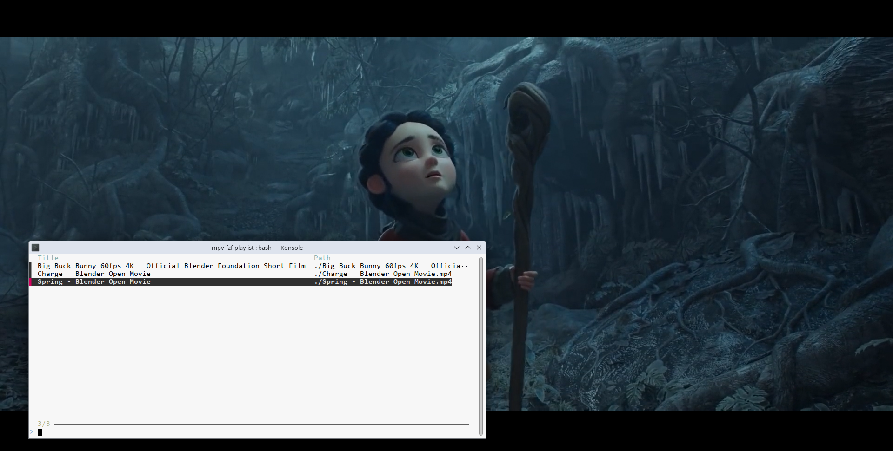

# Switch between mpv playlist entries using fzf (with EPG support in XMLTV format)

Jump between mpv playlist entries using your terminal.
Use a fuzzy search to quickly find the entry you are looking for.

If you are watching IPTV you can provide an EPG file in XMLTV format to see
the title of the current TV program and the title and start time of the next one.

Tested only on Linux.

## Screenshots

<p align="center">
    
</p>

<p align="center">
    
</p>

## Requirements

* Works on Linux.

  Other operating systems are untested.
* Start your mpv instance with `--input-ipc-server` option, for example:
  ```
  mpv --input-ipc-server=/tmp/mpvsocket playlist.m3u8
  ```
* Make sure that you have installed:
  * [`fzf`](https://github.com/junegunn/fzf)
  * [`jq`]
  * `socat`
  * If you want to use the EPG feature: [`xq`](https://github.com/kislyuk/yq#xml-support) (`xq-python` on Debian/Ubuntu)

## Usage

Copy the `mpvpl` script somewhere in your `PATH`.

To see the current playlist and switch playlist entries, run the following:

```
mpvpl
```

If you are watching IPTV you can pass EPG in XMLTV format to see
the current and the next TV program:

> The names of channels in your playlist and in an XMLTV file must match.
> Otherwise, TV programs will not be listed.

```
mpvpl https://example.com/xmltv.xml.gz
```

You can press <kbd>Ctrl</kbd>+<kbd>R</kbd> to reload a playlist and programs.

The provided URL will be cached, and will be downloaded again only if it's changed on a server.

Internally, an `xml.gz` file will be converted to `json.gz` to make it possible to query
it using [`jq`].

<details>

<summary>You can convert an XMLTV file with the `xml.gz` extension to `json.gz` using the following command:</summary>

```
gzip -cd xmltv.xml.gz  | xq -c --xml-force-list display-name '(now | strflocaltime("%Y%m%d%H%M%S %z")) as $now | .tv.channel[],null,([.tv.programme[] | select(.["@stop"] >= $now)] | sort_by(.["@channel"], .["@stop"]) | .[])' - | gzip > xmltv.json.gz
```
The conversion can be time consuming and memory hungry for large files.

</details>

<br>

You can provide a path to the local XMLTV file:

```
mpvpl /path/to/xmltv.xml.gz
# Path to a JSON file converted using the xq command above
mpvpl /path/to/xmltv.json.gz
```

## Watch a demo

<video src="https://github.com/user-attachments/assets/798977d4-4ec0-4cff-ad72-8da7e3079540"></video>

## Limitations

* Timezone of _start_ and _stop_ time of TV programs is ignored.
  It's assumed that dates in the XMLTV file are in the local timezone.
* Conversion from XML to JSON is needed to be able to query TV programs using [`jq`]. It may take a lot of time depending on the EPG size, but it's done only once
  for each URL.

[`jq`]: https://github.com/jqlang/jq
